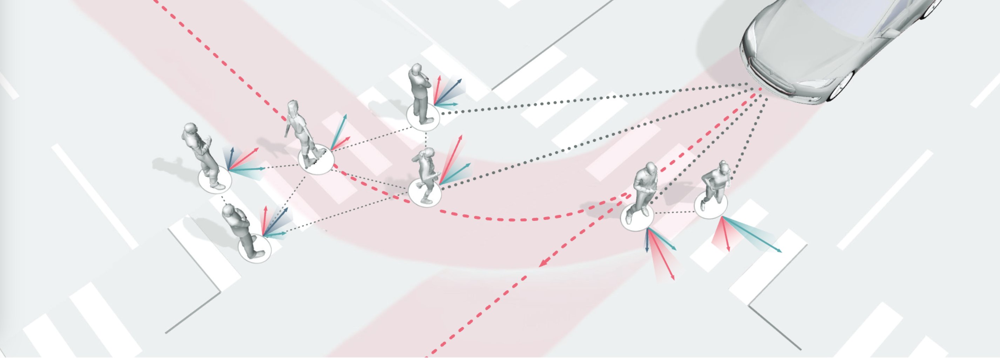

# Behavior Prediction

This repository is a paper digest of multi-agent behavior (motion / trajectory) prediction (forecasting / generation), especially in driving scenes. Papers are listed in alphabetical order of the first character. All links to the materials are freely accessible.

## :star2:Recommendation

### Helpful Learning Resource:thumbsup::thumbsup::thumbsup:

- **(Survey)** Social Interactions for Autonomous Driving: A Review and Perspectives [[paper](https://arxiv.org/abs/2208.07541)]
- **(Lecture)** Pedestrian Trajectory Prediction [[video](https://youtu.be/dSQMJBg47es)]
- **(Presentation)** Trajectory Forecasting in the Modern Robotic Autonomy Stack [[video](https://youtu.be/EVxS7tC9LMI)]
- **(Keynote)** The 7 Foundational Principles behind Autonomous Mobility [[video](https://youtu.be/Xgnc-CJi8zE)], Behavior Models for Autonomous Driving [[video](https://youtu.be/RpiN3LyMLB8)]
- **(Workshop)** CVPR 2023 Workshop on Autonomous Driving [[video](https://youtu.be/cOFjqeBNN6g)], CVPR 2022 Workshop on Autonomous Driving [[video](https://youtu.be/Z1q9ijuLLvU)], CVPR 2021 Workshop on Autonomous Driving [[video](https://youtu.be/DM8jWfi69zM)]

## :bookmark:Benchmarks

### ICCV 2021:tada::tada::tada:

- **WOSAC** (The Waymo Open Sim Agents Challenge) [[paper](https://arxiv.org/abs/2305.12032)] [[code](https://github.com/waymo-research/waymo-open-dataset)] [[challenge](https://waymo.com/open/challenges/2023/sim-agents)]
  - Nico Montali, John Lambert, Paul Mougin, Alex Kuefler, Nick Rhinehart, Michelle Li, Cole Gulino, Tristan Emrich, Zoey Yang, Shimon Whiteson, Brandyn White, Dragomir Anguelov
- **WOMD** (Large Scale Interactive Motion Forecasting for Autonomous Driving : The Waymo Open Motion Dataset) [[paper](https://arxiv.org/abs/2104.10133)] [[code](https://github.com/waymo-research/waymo-open-dataset)] [[challenge](https://waymo.com/open/challenges/2023/motion-prediction)]
  - Scott Ettinger, Shuyang Cheng, Benjamin Caine, Chenxi Liu, Hang Zhao, Sabeek Pradhan, Yuning Chai, Ben Sapp, Charles Qi, Yin Zhou, Zoey Yang, Aurelien Chouard, Pei Sun, Jiquan Ngiam, Vijay Vasudevan, Alexander McCauley, Jonathon Shlens, Dragomir Anguelov

## :bookmark:Approaches

### Selected Preprint

- **CU-aware** (Collaborative Uncertainty Benefits Multi-Agent Multi-Modal Trajectory Forecasting) [[paper](https://arxiv.org/abs/2207.05195)] [[code](https://github.com/MediaBrain-SJTU/Collaborative-Uncertainty)] [~~demo~~]
  - Bohan Tang, Yiqi Zhong, Chenxin Xu, Wei-Tao Wu, Ulrich Neumann, Yanfeng Wang, Ya Zhang, Siheng Chen
- **DCMS** (DCMS: Motion Forecasting with Dual Consistency and Multi-Pseudo-Target Supervision) [[paper](https://arxiv.org/abs/2204.05859)] [~~code~~] [~~demo~~]
  - Maosheng Ye, Jiamiao Xu, Xunnong Xu, Tengfei Wang, Tongyi Cao, Qifeng Chen
- **DyGroupNet** (Dynamic-Group-Aware Networks for Multi-Agent Trajectory Prediction with Relational Reasoning) [[paper](https://arxiv.org/abs/2206.13114)] [[code](https://github.com/MediaBrain-SJTU/GroupNet)] [~~demo~~]
  - Chenxin Xu, Yuxi Wei, Bohan Tang, Sheng Yin, Ya Zhang, Siheng Chen
- **HDGT** (HDGT: Heterogeneous Driving Graph Transformer for Multi-Agent Trajectory Prediction via Scene Encoding) [[paper](https://arxiv.org/abs/2205.09753)] [[code](https://github.com/OpenPerceptionX/HDGT)] [~~demo~~]
  - Xiaosong Jia, Penghao Wu, Li Chen, Hongyang Li, Yu Liu, Junchi Yan
- **MTR++** (MTR++: Multi-Agent Motion Prediction with Symmetric Scene Modeling and Guided Intention Querying) [[paper](https://arxiv.org/abs/2306.17770)] [[code](https://github.com/sshaoshuai/MTR)] [~~demo~~]
  - Shaoshuai Shi, Li Jiang, Dengxin Dai, Bernt Schiele
- **QCNeXt** (QCNeXt: A Next-Generation Framework For Joint Multi-Agent Trajectory Prediction) [[paper](https://arxiv.org/abs/2306.10508)] [[code](https://github.com/ZikangZhou/QCNet)] [~~demo~~]
  - Zikang Zhou, Zihao Wen, Jianping Wang, Yung-Hui Li, Yu-Kai Huang

### CVPR 2023:tada::tada::tada:

- **EqMotion** (EqMotion: Equivariant Multi-agent Motion Prediction with Invariant Interaction Reasoning) [[paper](https://arxiv.org/abs/2303.10876)] [[code](https://github.com/MediaBrain-SJTU/EqMotion)] [[demo](https://youtu.be/ROactuGU1YA)]
  - Chenxin Xu, Robby T. Tan, Yuhong Tan, Siheng Chen, Yu Guang Wang, Xinchao Wang, Yanfeng Wang
- **FJMP** (FJMP: Factorized Joint Multi-Agent Motion Prediction over Learned Directed Acyclic Interaction Graphs) [[paper](https://arxiv.org/abs/2211.16197)] [[code](https://github.com/RLuke22/FJMP)] [[demo](https://youtu.be/asmCOhPQuNw)]
  - Luke Rowe, Martin Ethier, Eli-Henry Dykhne, Krzysztof Czarnecki
- **MotionDiffuser** (MotionDiffuser: Controllable Multi-Agent Motion Prediction using Diffusion) [[paper](https://arxiv.org/abs/2306.03083)] [~~code~~] [[demo](https://youtu.be/IfGTZwm1abg)]
  - Chiyu Max Jiang, Andre Cornman, Cheolho Park, Ben Sapp, Yin Zhou, Dragomir Anguelov
- **QCNet** (Query-Centric Trajectory Prediction) [[paper](https://openaccess.thecvf.com/content/CVPR2023/html/Zhou_Query-Centric_Trajectory_Prediction_CVPR_2023_paper.html)] [[code](https://github.com/ZikangZhou/QCNet)] [[demo](https://youtu.be/i46Sj0PUwyI)]
  - Zikang Zhou, Jianping Wang, Yung-Hui Li, Yu-Kai Huang

### CoRL 2023:tada::tada::tada:

- **JFP** (JFP: Joint Future Prediction with Interactive Multi-Agent Modeling for Autonomous Driving) [[paper&review](https://openreview.net/forum?id=Y42uoIekm5b)] [~~code~~] [~~demo~~]
  - Wenjie Luo, Cheolho Park, Andre Cornman, Benjamin Sapp, Dragomir Anguelov

### CVPR 2022:tada::tada::tada:

- **GroupNet** (GroupNet: Multiscale Hypergraph Neural Networks for Trajectory Prediction with Relational Reasoning) [[paper](https://arxiv.org/abs/2204.08770)] [[code](https://github.com/MediaBrain-SJTU/GroupNet)] [[demo](https://youtu.be/02LnbEErlDc)]
  - Chenxin Xu, Maosen Li, Zhenyang Ni, Ya Zhang, Siheng Chen
- **HiVT** (HiVT: Hierarchical Vector Transformer for Multi-Agent Motion Prediction) [[paper](https://openaccess.thecvf.com/content/CVPR2022/html/Zhou_HiVT_Hierarchical_Vector_Transformer_for_Multi-Agent_Motion_Prediction_CVPR_2022_paper.html)] [[code](https://github.com/ZikangZhou/HiVT)] [~~demo~~]
  - Zikang Zhou, Luyao Ye, Jianping Wang, Kui Wu, Kejie Lu
- **M2I** (M2I: From Factored Marginal Trajectory Prediction to Interactive Prediction) [[paper](https://arxiv.org/abs/2202.11884)] [[code](https://github.com/Tsinghua-MARS-Lab/M2I)] [~~demo~~]
  - Qiao Sun, Xin Huang, Junru Gu, Brian C. Williams, Hang Zhao

### NeurIPS 2022:tada::tada::tada:

- **IMMA** (Interaction Modeling with Multiplex Attention) [[paper&review](https://openreview.net/forum?id=SeHslYhFx5-)] [[code](https://github.com/sunfanyunn/IMMA)] [~~demo~~]
  - Fan-Yun Sun, Isaac Kauvar, Ruohan Zhang, Jiachen Li, Mykel Kochenderfer, Jiajun Wu, Nick Haber
- **MTR** (Motion Transformer with Global Intention Localization and Local Movement Refinement) [[paper&review](https://openreview.net/forum?id=9t-j3xDm7_Q)] [[code](https://github.com/sshaoshuai/MTR)] [~~demo~~]
  - Shaoshuai Shi, Li Jiang, Dengxin Dai, Bernt Schiele

### ICLR 2022:tada::tada::tada:

- **Scene Transformer** (Scene Transformer: A Unified Architecture for Predicting Multiple Agent Trajectories) [[paper&review](https://openreview.net/forum?id=Wm3EA5OlHsG)] [[code](https://github.com/Chen-Albert-FENG/SceneTransformer)] [~~demo~~]
  - Jiquan Ngiam, Benjamin Caine, Vijay Vasudevan, Zhengdong Zhang, Hao-Tien Lewis Chiang, Jeffrey Ling, Rebecca Roelofs, Alex Bewley, Chenxi Liu, Ashish Venugopal, David Weiss, Ben Sapp, Zhifeng Chen, Jonathon Shlens
- **THOMAS** (THOMAS: Trajectory Heatmap Output with learned Multi-Agent Sampling) [[paper&review](https://openreview.net/forum?id=QDdJhACYrlX)] [~~code~~] [~~demo~~]
  - Thomas Gilles, Stefano Sabatini, Dzmitry Tsishkou, Bogdan Stanciulescu, Fabien Moutarde

### ICRA 2022

- **MultiPath++** (MultiPath++: Efficient Information Fusion and Trajectory Aggregation for Behavior Prediction) [[paper](https://arxiv.org/abs/2111.14973)] [[code](https://github.com/stepankonev/waymo-motion-prediction-challenge-2022-multipath-plus-plus)] [~~demo~~]
  - Balakrishnan Varadarajan, Ahmed Hefny, Avikalp Srivastava, Khaled S. Refaat, Nigamaa Nayakanti, Andre Cornman, Kan Chen, Bertrand Douillard, Chi Pang Lam, Dragomir Anguelov, Benjamin Sapp
- **PredictionNet** (PredictionNet: Real-Time Joint Probabilistic Traffic Prediction for Planning, Control, and Simulation) [[paper](https://arxiv.org/abs/2109.11094)] [~~code~~] [[demo](https://youtu.be/C7Nb3DRjFP0)]
  - Alexey Kamenev, Lirui Wang, Ollin Boer Bohan, Ishwar Kulkarni, Bilal Kartal, Artem Molchanov, Stan Birchfield, David Nistér, Nikolai Smolyanskiy

### CVPR 2021:tada::tada::tada:

- **TPCN** (TPCN: Temporal Point Cloud Networks for Motion Forecasting) [[paper](https://arxiv.org/abs/2103.03067)] [~~code~~] [~~demo~~]
  - Maosheng Ye, Tongyi Cao, Qifeng Chen
- **TrafficSim** (TrafficSim: Learning to Simulate Realistic Multi-Agent Behaviors) [[paper](https://arxiv.org/abs/2101.06557)] [~~code~~] [[demo](https://youtu.be/n6C788TmBDY)]
  - Simon Suo, Sebastian Regalado, Sergio Casas, Raquel Urtasun

### NeurIPS 2021:tada::tada::tada:

- **CU-based** (Collaborative Uncertainty in Multi-Agent Trajectory Forecasting) [[paper&review](https://openreview.net/forum?id=sO4tOk2lg9I)] [[code](https://github.com/MediaBrain-SJTU/Collaborative-Uncertainty)] [[demo](https://youtu.be/udlu7C0nX8o)]
  - Bohan Tang, Yiqi Zhong, Ulrich Neumann, Gang Wang, Ya Zhang, Siheng Chen

### ICCV 2021:tada::tada::tada:

- **AgentFormer** (AgentFormer: Agent-Aware Transformers for Socio-Temporal Multi-Agent Forecasting) [[paper](https://arxiv.org/abs/2103.14023)] [[code](https://github.com/Khrylx/AgentFormer)] [[demo](https://www.xinshuoweng.com/papers/AgentFormer/demo.mp4)]
  - Ye Yuan, Xinshuo Weng, Yanglan Ou, Kris Kitani
- **DenseTNT** (DenseTNT: End-to-end Trajectory Prediction from Dense Goal Sets) [[paper](https://arxiv.org/abs/2108.09640)] [[code](https://github.com/Tsinghua-MARS-Lab/DenseTNT)] [~~demo~~]
  - Junru Gu, Chen Sun, Hang Zhao

### CoRL 2021:tada::tada::tada:

- **CEAV** (Multi-Agent Trajectory Prediction by Combining Egocentric and Allocentric Views) [[paper&review](https://openreview.net/forum?id=lAtePxetBNb)] [~~code~~] [[demo](https://youtu.be/l96YYO9bC8M)]
  - Xiaosong Jia, Liting Sun, Hang Zhao, Masayoshi Tomizuka, Wei Zhan

### WACV 2021

- **GraphTCN** (GraphTCN: Spatio-Temporal Interaction Modeling for Human Trajectory Prediction) [[paper](https://arxiv.org/abs/2003.07167)] [~~code~~] [[demo](https://youtu.be/Kq0K5DeBL9g)]
  - Chengxin Wang, Shaofeng Cai, Gary Tan

### CVPR 2020:tada::tada::tada:

- **RSBG** (Recursive Social Behavior Graph for Trajectory Prediction) [[paper](https://arxiv.org/abs/2004.10402)] [~~code~~] [~~demo~~]
  - Jianhua Sun, Qinhong Jiang, Cewu Lu
- **VectorNet** (VectorNet: Encoding HD Maps and Agent Dynamics from Vectorized Representation) [[paper](https://arxiv.org/abs/2005.04259)] [[code](https://github.com/Henry1iu/TNT-Trajectory-Prediction)] [[demo](https://youtu.be/yJFtf-fz3WA)]
  - Jiyang Gao, Chen Sun, Hang Zhao, Yi Shen, Dragomir Anguelov, Congcong Li, Cordelia Schmid

### NeurIPS 2020:tada::tada::tada:

- **EvolveGraph** (EvolveGraph: Multi-Agent Trajectory Prediction with Dynamic Relational Reasoning) [[paper&review](https://proceedings.neurips.cc/paper/2020/hash/e4d8163c7a068b65a64c89bd745ec360-Abstract.html)] [[code](https://github.com/huanshayun/EvolveGraph_realize)] [[demo](https://slideslive.com/38941510/evolvegraph-multiagent-trajectory-prediction-with-dynamic-relational-reasoning)]
  - Jiachen Li, Fan Yang, Masayoshi Tomizuka, Chiho Choi

### ECCV 2020:tada::tada::tada:

- **DSDNet** (DSDNet: Deep Structured Self-Driving Network) [[paper](https://arxiv.org/abs/2008.06041)] [~~code~~] [[demo](https://youtu.be/hop6FBJnM-c)]
  - Wenyuan Zeng, Shenlong Wang, Renjie Liao, Yun Chen, Bin Yang, Raquel Urtasun
- **LaneGCN** (Learning Lane Graph Representations for Motion Forecasting) [[paper](https://arxiv.org/abs/2007.13732)] [[code](https://github.com/uber-research/LaneGCN)] [[demo](https://youtu.be/nxRSZ7t5OW4)]
  - Ming Liang, Bin Yang, Rui Hu, Yun Chen, Renjie Liao, Song Feng, Raquel Urtasun
- **STAR** (Spatio-Temporal Graph Transformer Networks for Pedestrian Trajectory Prediction) [[paper](https://arxiv.org/abs/2005.08514)] [[code](https://github.com/Majiker/STAR)] [[demo](https://youtu.be/5tS5Xe-DERo)]
  - Cunjun Yu, Xiao Ma, Jiawei Ren, Haiyu Zhao, Shuai Yi
- **Trajectron++** (Trajectron++: Dynamically-Feasible Trajectory Forecasting With Heterogeneous Data) [[paper](https://arxiv.org/abs/2001.03093)] [[code](https://github.com/StanfordASL/Trajectron-plus-plus)] [~~demo~~]
  - Tim Salzmann, Boris Ivanovic, Punarjay Chakravarty, Marco Pavone

### CoRL 2020:tada::tada::tada:

- **DROGON** (DROGON: A Trajectory Prediction Model based on Intention-Conditioned Behavior Reasoning) [[paper](https://arxiv.org/abs/1908.00024)] [~~code~~] [[demo](https://youtu.be/PQlWx8AmoAs)]
  - Chiho Choi, Srikanth Malla, Abhishek Patil, Joon Hee Choi
- **MATS** (MATS: An Interpretable Trajectory Forecasting Representation for Planning and Control) [[paper](https://arxiv.org/abs/2009.07517)] [[code](https://github.com/StanfordASL/MATS)] [[demo](https://youtu.be/ZFJKyZ8-MgE)]
  - Boris Ivanovic, Amine Elhafsi, Guy Rosman, Adrien Gaidon, Marco Pavone
- **TNT** (TNT: Target-Driven Trajectory Prediction) [[paper](https://arxiv.org/abs/2008.08294)] [[code](https://github.com/Henry1iu/TNT-Trajectory-Prediction)] [[demo](https://youtu.be/iaaCbKncY-8)]
  - Hang Zhao, Jiyang Gao, Tian Lan, Chen Sun, Benjamin Sapp, Balakrishnan Varadarajan, Yue Shen, Yi Shen, Yuning Chai, Cordelia Schmid, Congcong Li, Dragomir Anguelov

### ICCV 2019:tada::tada::tada:

- **Trajectron** (The Trajectron: Probabilistic Multi-Agent Trajectory Modeling With Dynamic Spatiotemporal Graphs) [[paper](https://arxiv.org/abs/1810.05993)] [[code](https://github.com/StanfordASL/Trajectron)] [~~demo~~]
  - Boris Ivanovic, Marco Pavone

### CoRL 2019:tada::tada::tada:

- **MultiPath** (MultiPath: Multiple Probabilistic Anchor Trajectory Hypotheses for Behavior Prediction) [[paper](https://arxiv.org/abs/1910.05449)] [~~code~~] [~~demo~~]
  - Yuning Chai, Benjamin Sapp, Mayank Bansal, Dragomir Anguelov